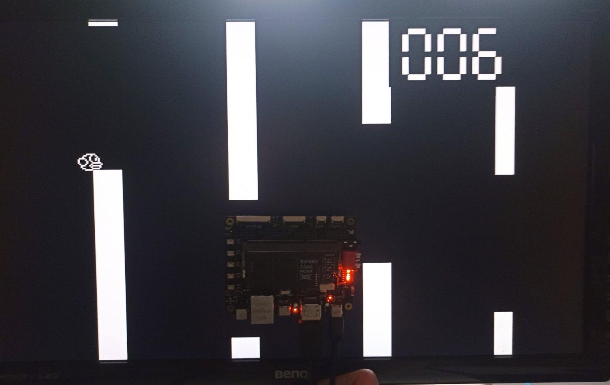
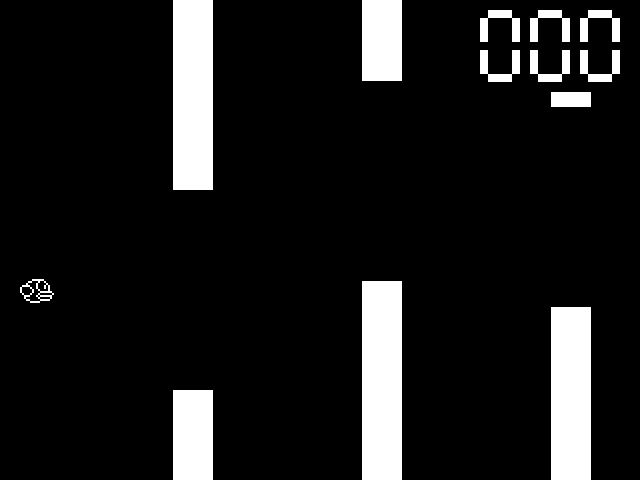

# flappy_bird

Flappy Bird game on Sipeed Tang Primer 20K FPGA board.

## Key features

* Resolution: 640x480 60 FPS
* Double buffered HDMI video output using two 300 Kbit BSRAMs and GOWIN DVI TX IP core
* 64.125 MHz frequency for [cpu](src/cpu.sv) and [gpu](src/gpu.sv) modules
* Autoplay switch: game plays itself!

## [main](https://github.com/trickybestia/flappy_bird/tree/main) branch

Logic is splitted between [cpu](src/cpu.sv) and [gpu](src/gpu.sv) modules. GPU draws primitives: filled and textured rectangles. CPU sends commands to GPU.

### Uploading to board

1. Open project in GOWIN FPGA DESIGNER.
2. Click "Run all".
3. Set 1, 2, 3, 4 switches to "on" and 5 switch to "off" on board.
4. Open Programmer and click "Program/Configure".
5. Connect board to monitor using HDMI.
6. Press "S1" button once.

### Controls

Switch 1 should always be enabled (check [Sipeed Wiki](https://wiki.sipeed.com/hardware/en/tang/tang-primer-20k/primer-20k.html#Dock-ext-board-not-work)).

Remaining switches functions are shown in table below.

| 5 | 4 | 3 | 2 | Description  | Buttons |
|---|---|---|---|--------------|---------|
| 0 | 0 | 0 | 1 | Red screen   | |
| 0 | 0 | 1 | 0 | Green screen | |
| 0 | 0 | 1 | 1 | Blue screen  | |
| 0 | 1 | 0 | 0 | Test pattern 1 (diagonals) | |
| 0 | 1 | 0 | 1 | Test pattern 2 (XOR) | Hold S2 to invert colors | 
| 0 | 1 | 1 | 0 | Flappy Bird, autoplay off | Hold S2 to make bird fly up |
| 0 | 1 | 1 | 1 | Flappy Bird, autoplay on | Hold S2 to make bird fly up |
| 1 | 0 | 0 | 0 | Test pattern using framebuffer (XOR) | Hold S2 to invert colors |
| x | x | x | x | Black screen | |

Button S0 resets almost all modules.

Button S1 resets only modules that draw pixels to framebuffer and farther, it does not reset framebuffer.

### Model

There is a high-level game model written in Python to debug game logic.

To launch it make sure that you have [pygame](https://pypi.org/project/pygame/) installed and run `python -m model`.

Press `SPACE` to make bird fly up and `A` to toggle autoplay (default on).

### Testbenches

Testbenches are located in [tb](tb) folder. To run them install Icarus Verilog and GTKWave and follow instructions in [tb/README](tb/README.md).

## Old [single-fsm](https://github.com/trickybestia/flappy_bird/tree/single-fsm) branch

All logic is implemented using single FSM, which renders pixels to framebuffer. Not a good example of SystemVerilog development. 😅

## License

Licensed under [MIT license](LICENSE) only.
